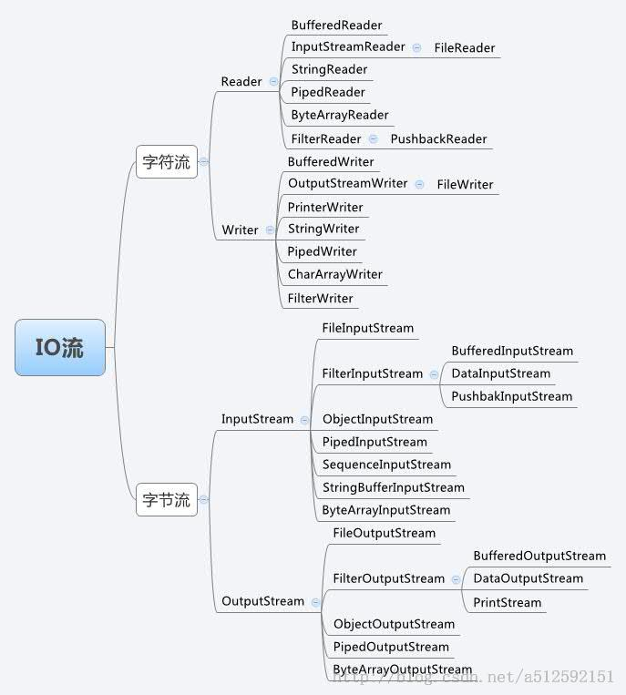

### 装饰器模式

---

#### 定义

* 装饰器模式（Decorator Pattern）允许向一个现有的对象添加新的功能，同时又不改变其结构。
* 属于结构型模式，它是作为现有的类的一个包装。
* 创建了一个装饰类，用来包装原有的类，并在保持类方法签名完整性的前提下，提供了额外的功能。

#### UML图
参考[菜鸟教程](http://www.runoob.com/design-pattern/decorator-pattern.html)给出的UML图如下：

#### 组成结构

##### 案例

* 以绘制图形（Shape）为例，可以绘制圆形，矩形等，属于基本组件
* 当需要绘制不同颜色的图形是，可以使用组件装饰者类实现扩展功能 
* 在组件修饰者中，既可以实现基本组件的功能，也可以实现修饰功能

##### 案例结构

* Component抽象类：基本组件的父类
	* `Shape`
		* `draw()`

* Component实现类：实现基本组件的功能
	* `CicleShape`
		* `draw()`
	* `RectangleShape`
		* `draw()`

* ComponentDecorator抽象类：基本组件的修饰功能的父类，需要持有基本组件的引用
	* `ShapeDecorator`
		* `public ShapeDecorator(Shape shape)`
		* `draw()`

* ComponentDecorator实现类：实现对修饰类的功能
	* `RedShapeDecorator`
		* `public RedShapeDecorator(Shape shape)`
		* `draw()`
		* `decorator()`
	* `GreenShapeDecorator`
		* `public GreenShapeDecorator(Shape shape)`
		* `draw()`
		* `decorator()`

* 参考源码：`src/designpattern/decorator`

#### Java IO 中的应用

Java IO的结构图如下：（[参考](http://blog.csdn.net/yczz/article/details/38761237)）

#### 优缺点

* 优点
	* 装饰类和被装饰类可以独立发展，不会相互耦合
	* 装饰模式是继承的一个替代模式
	* 装饰模式可以动态扩展一个实现类的功能。

* 缺点：
	* 多层装饰比较复杂

#### 使用场景

* 扩展一个类的功能
* 动态增加功能，动态撤销
* 需要扩展不同功能时，可以代替继承

##### 参考

* http://www.runoob.com/design-pattern/decorator-pattern.html
* http://www.cnblogs.com/ikuman/archive/2013/01/29/2877913.htm
* http://blog.csdn.net/caihuangshi/article/details/51334097

---
@FrankJiang

2016-9-9