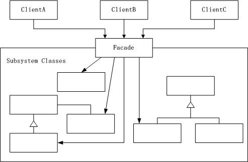

### 外观模式

---

#### 外观模式定义
为子系统中的一组接口提供一个一致的界面，Facade模式定义了一个高层接口，这个接口使得这一子系统更加容易使用。

#### UML图

如下为参考网上的一张UML图，助于理解：



#### 外观模式目的

不是给子系统添加新的功能接口，而是为了让外部减少与子系统内多个模块的交互，松散耦合，从而让外部能够更简单的使用子系统。

#### 优缺点

* 优点
	- 松散耦合
	- 简单易用
	- 更好的划分访问的层次
* 缺点
	- 过多的或者是不太合理的Facade也容易让人迷惑。到底是调用Facade好还是直接调用模块好。
	
#### 本质

封装交互，简化调用

#### 何时选用外观模式

* 如果你希望为复杂的子系统提供一个简单接口的时候，可以考虑使用外观模式。使用外观对象对实现大部分客户需要的功能，从而简化客户的使用。
* 如果想要让客户程序和抽象类的实现部分松散耦合，可以考虑使用外观模式，使用外观对象来将这个子系统与它的客户分离开来，从而提高子系统的独立性和可移植性。
* 如果构建多层结构的系统，可以考虑使用外观模式，使用外观对象作为每层的入口，这样就可以简化层间调用，也可以松散层次之间的依赖关系。

#### 具体实现

已组装电脑为例，客户想要自己组装一台电脑，需要有以下几个子流程：采购原材料（Purchase），组装（Install）和测试（Test）。如果客户想要自己完成组装电脑的流程，则需要依次执行：Purchase--->Install--->Test。这样在执行起来比较复杂

但是，如果客户仅仅想要一台组装好的电脑，具体的组装流程不需要自己去实现，他只需要找一个专业的电脑组装人员帮他完成即可。而专业的电脑组装人员就会去一次执行：Purchase--->Install--->Test，最终完成电脑的组装。而电脑组装人员即为外观类。

* 子流程接口设计：

	- 采购接口：IPurchase
	
		- 采购方法：purchase()
		
	- 组装接口：IInstall
	
		- 组装方法：install()
		
	- 测试接口：ITest
	
		- 测试方法：test()
* 子流程具体实现类：

	- 采购类：IPurchaseImpl
	
	- 组装类：IInstallImpl
	
	- 测试类：ITestImpl
	
* 外观类设计：

	- 电脑组装类：MakeComputor
	
		- 组装方法：make()
		
``` java
public class MakeComputor {
	public void make() {
		IPurchase purchaser = new IPurchaseImpl();
		IInstall installer = new IInstallImpl();
		ITest tester = new ITestImpl();
		System.out.println(">>>Make Computor : Start<<<");
		purchaser.purchase();
		installer.install();
		tester.test();
		System.out.println(">>>Make Computor : Finish<<<");
	}
}
```

* 客户设计：
	
	- 客户类Client：在Client类中直接调用外观类（MakeComputor），然后调用其组装方法（make），即可完成电脑组装。

``` json
>>>Make Computor : Start<<<
Make Computor : Purchase
Make Computor : Install
Make Computor : Test
>>>Make Computor : Finish<<<
```

* 代码参考：JavaNotes/src/designpattern/facade

##### 参考

* http://blog.csdn.net/jason0539/article/details/22775311
* https://github.com/GeniusVJR/LearningNotes/blob/master/Part1/DesignPattern/%E5%A4%96%E8%A7%82%E6%A8%A1%E5%BC%8F.md
* http://www.cnblogs.com/devinzhang/archive/2012/01/06/2315200.html

---
@Frank Jiang

2016-8-25
