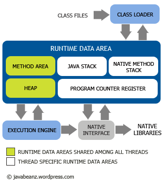

### JVM

---

#### JVM生命周期

* 每一个应用程序对应一个JVM
* 一个应用程序从main函数开始，会启动一个线程执行任务
* JVM有两种线程: 守护线程和非守护线程
* 应用程序默认为非守护线程，可以通过setDemon将自己的线程设置为守护线程
* 非守护线程执行完毕，虚拟机才会退出

#### JVM的执行过程

* JVM内部结构

* 类加载：`classloader`

* 运行时数据区：`runtime data area`
	* 读取class文件的二进制字节流到内存中
	* 每一个jvm实例都有一个方法区和堆区
	* 方法区`method area`
		* 所有线程共享
		* 解析完的class文件类型（类，接口，数组）信息；
	* 堆区`heap`
		* 所有线程共享，涉及到多线程访问 
		* 创建对象，数组
	* Java栈`java stack`
		* 对应每一个线程，线程私有
	* PC寄存器`program counter register`
		* 对应每一个线程，线程私有
		* 记录当前程序执行的位置
	* 本地方法栈

* 执行引擎：`execution engine`

#### 运行时数据区

* 方法区
	* 类的信息
		* 类，接口，数组？
		* 类的全名
		* 修饰符
		* 父接口，父类
		* 常量值
		* 字段
		* 方法
		* 静态变量
	* 也存在垃圾回收
* 堆区
	* 对象的存储方式
	* 数组？
	* 与对象创建与GC有关系
	* 对象锁

* Java栈
	* 每一个线程都有一个Java栈
	* 每一个方法从调用到执行，对应着一个栈帧在VM里面从入栈到出栈的过程
	* Java栈帧
		* 局部变量区：存储下标
		* 操作数栈
		* 帧数据区

#### 类加载器

* 装载
* 链接
* 初始化
* `Class.forName()`: 保证对驱动程序进行初始化
* `ClassLoader`
	* 分类
		* `BootStrap ClassLoader`:加载Java核心类库jre/lib
		* `Extension ClassLoader`:读取Java扩展类库jre/lib/ext
		* `App ClassLoader`:读取classpath指定的所有jar包和目录的类文件
		* `Custom ClassLoader`:用户自定义的，用来读取指定类文件
	* 双亲委派
		* 如何保证安全性
	* load流程
		
	* 定义类装载器：能装载某个类的装载器成为该类的定义类装载器
	* 初始类装载器：能够成功返回某类的class引用的装载器
	* 包装模式
* 运行时包
	* 避免用户冒充核心类库
* class文件
	* 开头字符：cafe babe
	* 主版本号和次版本号
	* 常量池
	* this class
	* super class

#### 执行引擎

* 指令集
	* 精简指令集
	* 操作码
	* 操作数
* 执行技术
	* 编译技术
* 线程相关
	* Java的优先级，不靠谱
* **Java内存模型**
	* JMM
	* 主存与工作内存
	* 多线程并发问题
* Java本地调用(JNI)

#### Java垃圾回收机制

* 检测
	* 根路径
	* 如何检测到对象可以被回收
		* 引用计数：无法解决循环引用和性能等问题，暂不采用
		* 标记清除：遍历所有，最后清除
		* 标记压缩；
		* 拷贝（copy）
		* 分代（generational collection）
		* 并发收集
		* 并行收集
		* 自适应收集
* 回收
* JVM内存管理模式
	* 分代管理
	* 可触及性
		* 强/软/弱/虚可触及
		* 对应引用（reference）：强/软/弱/虚引用
		* 软引用：缓存机制
		* 弱引用：WeakHashMap
		* *编程时如何使用？*
* Java中如何使用GC（不推荐使用）

#### Java性能准则

#### JVM的同步问题

#### JVM的对象创建
* 创建方式
	* new方式
	* 反射方式
	* clone方式
	* 序列化、反序列化
* 创建过程

#### JVM沙箱
* classloader 双亲委派
* 运行时包
* 文件检验器
* 安全管理器，保护域

#### JVM开源虚拟机
* openjdk_hospot
* javax_ibm

##### 参考

* [JVM内存管理机制](http://blog.csdn.net/lengyuhong/article/details/5953544)
* [JVM类加载那些事](http://www.jianshu.com/p/2133558b4735)
* [如何利用 JConsole观察分析Java程序的运行，进行排错调优](http://jiajun.iteye.com/blog/810150)
* [如何使用JVisualVM进行性能分析](http://jiajun.iteye.com/blog/1180230)
* [宋秉华JAVA虚拟机的实现机制讲座](http://v.youku.com/v_show/id_XMTUxMDM1OTcy.html?beta&)
* [JVM 的 工作原理，层次结构 以及 GC工作原理](https://segmentfault.com/a/1190000002579346)
* [JVM 栈帧](http://www.360doc.com/content/14/0925/13/1073512_412236522.shtml)
* [深入理解Java运行时数据区](http://blog.csdn.net/zhangjg_blog/article/details/24271275)
* [类加载器总结](http://blog.csdn.net/gjanyanlig/article/details/6818655)
* [Java GC基本算法](http://www.blogjava.net/showsun/archive/2011/07/21/354745.html)
* [java安全沙箱之ClassLoader双亲委派机制](http://my.oschina.net/xionghui/blog/499725#OSC_h1_3)
* [Java之深入JVM(6) - 字节码执行引擎(转)](http://www.cnblogs.com/royi123/p/3569511.html)