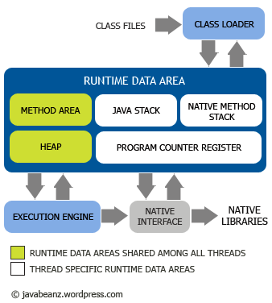
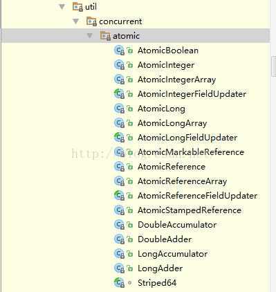

# Java线程

## 1. 线程与进程

### 1.1 进程

* 资源分配的**最小独立单位**。
* 就是一个应用程序在处理机制上的一次执行过程，它可以申请和拥有系统资源
* 进程是具有一定独立功能的程序关于某个数据集合上的一次运行活动，是系统进行资源分配和调度的一个独立单位。

### 1.2 线程

* 进程下的一个分支
* 是进程的一个实体，是CPU调度和分派的基本单位，是比进程更小的独立运行的基本单位
* 除了在运行中必不可少的资源外，线程本身基本不拥有系统资源，但是它可以与同一个进程的其他的线程共享进程中的全部资源
* 在运行时，只是暂用一些计数器、寄存器和栈 

### 1.3 两者关系

* 一个线程只能属于一个进程，而一个进程可以有多个线程，但至少有一个线程（通常说的主线程）。
* 资源分配给进程，同一进程的所有线程共享该进程的所有资源。
* 线程在执行过程中，需要协作同步。不同进程的线程间要利用消息通信的办法实现同步。
* 处理机分给线程，即真正在处理机上运行的是线程。
* 线程是指进程内的一个执行单元，也是进程内的可调度实体。

### 参考阅读

* [进程与线程的一个简单解释](http://www.ruanyifeng.com/blog/2013/04/processes_and_threads.html)
* [进程和线程有什么区别？](https://www.zhihu.com/question/21535820)
* [线程与进程的区别](http://www.jianshu.com/p/e5ae9cc7b8df)
	
## 2. Java线程

### 2.1 Java线程创建方法

* 继承Thread类

``` java
public class MyThread extends Thread {

	@Override
	public void run() {
		// TODO 	
	}
}
public class Test {
	public static void main(String[] args){
		MyThread thread = new MyThread();
		thread.start();
	}
}
```

* 实现Runnable接口

``` java
public class MyRunnable implements Runnable {

	@Override
	public void run() {
		// TODO 	
	}
}
public class Test {
	public static void main(String[] args){
		Thread thread = new Thread(new MyRunnable());
		thread.start();
	}
} 
```

### 2.2 Thread生命周期

* Thread状态转换图-1


注意：在上图中的blocked时，等待锁时会进入阻塞状态，获得锁时进入就绪状态（并不是进入synchronized块和退出synchronized块）

* Thread状态转换图-2


### 2.3 Thread的常用方法

* `start方法`:启动一个线程，系统为相应线程分配需要资源
* `run方法`:不需要用户调用，start启动线程后，线程获得cpu执行时间，便进入run方法执行任务
* `sleep方法`:相当于让线程睡眠，交出CPU，让CPU去执行其他的任务，线程进入阻塞状态；但是，**sleep不会释放锁**
* `yield方法`:让线程交出CPU权限，去执行其他线程；只让相同优先级的线程有获取CPU执行的机会；同样，**yield不会释放锁**
* `join方法`:线程A中调用线程B的`threadB.join()`，则线程A会等待线程B执行完毕或等待一定时间，相当于调用线程A的wait方法，**线程A进入阻塞状态，且释放锁**
* `interrupt方法`:可以中断处于阻塞状态的线程，并抛出一个异常
* `isInterrupt方法`:判断当前线程是否执行interrupt()，可以通过interrupt和isInterrupt方法，终止正在运行的线程
* `stop方法`:已废弃
* `destroy方法`:已废弃
* `getPriority`和`setPriority`：获取和设置优先级
* `setDaemon`和`isDaemon`：设置守护线程和判断是否是守护线程
* `静态currentThread方法`:获取当前线程

### 2.4 上下文切换

* 从一个线程运行过程转去运行另外一个线程，叫做线程上下文切换
* 上下文切换时，需要存储和恢复CPU状态，使线程执行能从中断点恢复执行

### 2.5 参考阅读

* [Java并发编程：Thread类的使用](http://www.cnblogs.com/dolphin0520/p/3920357.html)

## 3. 操作系统内存模型

### 3.1 内存模型

* 计算机执行执行
	* 每条指令都是在CPU中执行的，而执行指令过程中，势必涉及到数据的读取和写入。
	* 由于程序运行过程中的**临时数据是存放在主存（物理内存）**当中的
	* 高速缓存：由于CPU执行速度很快，而从内存读取数据和向内存写入数据的过程跟CPU执行指令的速度比起来要慢的多，因此如果任何时候对数据的操作都要通过和内存的交互来进行，会大大降低指令执行的速度。因此在CPU里面就有了高速缓存。
	* 具体过程：当程序在运行时，会将运算需要的数据从主存复制一份到CPU的高速缓存当中，那么CPU进行计算时就可以直接从它的高速缓存读取数据和向其中写入数据，当运算结束之后，再将高速缓存中的数据刷新到主存当中
	* 在多线程访问共享变量时，就会出现**缓存一致性问题**
	
* 内存模型示意图


* 缓存一致性问题解决方法
	* 总线加LOCK# 锁的方式：阻塞其他CPU对内存的访问，使得只有一个CPU能使用这个变量；但是锁住总线后，其他CPU无法访问内存，导致效率低下
	* 缓存一致性协议：保证每个缓存中使用的共享变量的副本是一致的
		* 核心思想：CPU写数据时，如果该变量是共享变量，会发出信号通知其他CPU将该变量的缓存行置为无效；其他CPU需要读这个变量时，发现自己缓存中该变量的缓存行无效，则会从内存中重新读取
		* 问题：如果其他CPU已经读到了该变量，并对该变量做了修改，会不会重新从内存中读取？？？

### 3.2 并发编程相关概念

* 原子性
	* 一个操作或多个操作，要么全部执行并且执行过程不会被任何因素打断，要么就不执行
	* 银行转账问题

* 可见性
	* 多个线程访问同一个变量（共享变量）时，一个线程修改了这个变量的值，其他线程能够立即看得到修改后的值
	* 由于高速缓存的存在，线程A修改后的变量可能只写入到缓存中，但是此时另一个线程在读取变量时，只能从自己的缓存中读到与内存中原始值相同的值，而不是修改后的值

* 有序性
	* 程序执行的顺序按照代码的先后顺序执行
	* 指令重排序：一般来说，处理器为提高程序运行效率，可能会对输入代码进行优化，不保证程序中各个语句的执行先后顺序同代码中的顺序一致，但是会保证最终执行结果和代码顺序执行结果相同
	* 如果存在数据依赖的情况下，不会执行指令重排序
	* 但是，在每个线程里面不存在数据依赖，但是在线程之间可能存在数据依赖，所以多线程情况下指令重排序将会导致异常出现

### 3.3 参考阅读

* [Java并发编程：volatile关键字解析](http://www.cnblogs.com/dolphin0520/p/3920373.html)：大力推荐
* [Java 理论与实践: 正确使用 Volatile 变量](http://www.ibm.com/developerworks/cn/java/j-jtp06197.html)

## 4. Java内存模型（JMM）

### 4.1 JVM结构

* 参考[另一篇文章](JVM.md)

* JVM架构图



### 4.2 JMM

* JMM示意图


* 内存模型
	* 所有变量都是存在主存当中，类似于前面说的物理内存（Java堆）
	* 每个线程都有自己的工作内存，类似于前面的高速缓存（Java栈）
	* 线程对变量的操作必须在工作内存中进行，而不能直接对主存操作；并且线程不能访问其他线程的工作内存

* Java中的原子性
	* Java中，对基本数据类型的变量读取和赋值操作（仅仅x = 10）时原子性操作，这些操作不可被中断
	* 变量之间的相互赋值不是原子操作
	* 如果要实现更大范围的原子操作，必须使用synchronized和Lock来实现
	
* Java中的可见性
	* Java中提供volatile关键字保证可见性：当一个共享变量被volatile修饰时，保证修改的值立即更新到主存，当有其他线程需要读取时，去内存中读取新值
	* synchronized和Lock也能够保证可见性，当释放锁前会强制将变量刷新到主存中

* Java中的有序性
	* 在Java内存模型中允许编译器和执行器对指令重排序，但是重排序过程不影响到单线程的执行结果，但是会影响到多线程并发执行的正确性
	* 通过volatile来保证有序性，也可以通过synchronized和lock来保证有序性

* Java 先行发生（happens-before）原则

|   原 则     | 详  解 |
| :-----: | :--- |
|程序次序原则 |一个线程中，按照代码顺序，书写在前面的操作先行发生在书写在后面的操作 |
|锁定原则 |一个unlock操作先行发生于后面对**同一个锁**的lock操作 |
|volatile原则 |对一个变量的写操作先行发生于后面对这个变量的读操作 |
|传递原则 |A先行发生于B，B先行发生于C，则A先行发生于C |
|线程启动原则 |Thread对象的start()方法先行发生于此线程的每一个动作 |
|线程中断原则 |对线程interrupt()调用先行发生于被中断线程检测到中断事件发生 |
|线程终结原则 |线程所有操作先行发生于线程的终止检测，通过Thread.join()结束，Thread.isAlive()检测 |
|对象终结原则 |一个对象的初始化完成先行于他的finalize()方法的开始 |

**注  意**
	* 程序次序原则：对于单个线程**看起来有序**，保证单线程执行正确性，但依然有可能发送指令重排序
	* volatile原则：如果一个线程先写一个变量，另一个线程去进行读取，则写入操作一定发生在读操作之前

### 4.3 参考阅读

* [**Java并发编程：volatile关键字解析**](http://www.cnblogs.com/dolphin0520/p/3920373.html)：极力推荐
* [**Java内存模型**](http://www.cnblogs.com/BangQ/p/4045954.html)：超详细
* [Java内存模型](http://www.cnblogs.com/nexiyi/p/java_memory_model_and_thread.html)

## 5. synchronized、lock、volatile、atomic详解

### 5.1 synchronized

* synchronized: Java中的关键字，用来修饰一个**方法**或者一个**代码块**，保证同一时刻最多只有一个线程执行该段代码

* synchronized修饰**方法**
	* 同一时刻对于某一个object，其所声明为synchronized的成员函数至多只有一个处于可执行状态，其他非synchronized的方法可以正常执行
	* 每一个synchronized方法需要获得object的锁，一旦执行，就独占该锁，方法返回时释放该锁
	* 有效类成员变量的访问冲突（只要所有可能访问类成员的方法均被声明为synchronized）
	* synchronized方法获得的锁是调用该方法的object的锁（**对象锁**），不同的对象调用同一个synchronized方法是可以执行的
	* synchronized的静态成员函数，所获得的锁为类的锁（**类锁**），所有该类的实例对象都不能同时执行该方法，可以控制对该类静态成员变量的访问

* synchronized修饰**代码块**
	* synchronized代码块：其中的代码**必须获得对象的锁**方能执行；且可**任意指定上锁的对象**
	* 两个并发线程访问同一个object中的synchronized(this)代码块时，同一时间只能有一个线程可以执行；另一个线程必须等待当前线程执行完这个代码块后才可以执行该代码块
	* 一个线程访问object的一个synchronized(this)同步代码块时，另一个线程可以访问该object的非synchronized(this)代码块
	* 一个线程访问object的一个synchronized(this)代码块时，其他线程对该object中其他synchronized(this)同步代码块的访问将被阻塞
	* 一个线程访问object的一个synchronized(this)代码块时，它就获得该object的对象锁，其他线程对该object对象的所有同步代码部分的访问都暂时阻塞
	
* 对象锁与类锁
	* 如果一个类中定义了synchronized的static函数A，也定义了synchronized的函数B，则**函数A获得的锁为类锁，函数B获得的锁为对象锁**
		* 在多线程中，这个类的同一个对象分别访问A和B两个函数，不会构成同步，因为使用的锁不一样
	* `.class`和`getClass`的区别？？（《Effective Java》）
		* `synchronized(Foo.class)`
		* `synchronized(f.getClass())` 

* 共享资源同步访问安全的技巧
	* 定义private的instance变量和get方法，不要定义为public/protected；否则，对象在外界可以绕过同步方法的控制而直接取得它并改动它，这也是JavaBean的标准实现方式
	* 如果instance变量是一个对象，那上述方法仍不安全，因为外界get到的时这个instance的引用；这时候需要将get方法也加上synchronized同步，并只返回这个private对象的clone()，调用端使用的就是对象副本的引用

* 参考：[Java synchronized详解](http://www.cnblogs.com/GnagWang/archive/2011/02/27/1966606.html)

### 5.2 lock

* `java.util.concurrent.locks.Lock`：Lock接口
	* `void lock()`：获取锁；如果锁已被其他线程获取，则进行等待；获取锁后，必须主动释放锁，并且在异常时，不会自动释放锁
	* `void lockInterruptibly() throws InterruptedException`：通过该方法去获取锁时，如果线程正在等待获取锁，这个线程可以响应中断，即中断等待状态；调用thread.interrupt()可以中断等待；会抛出异常InterruptedException；如果线程获取到锁之后，是不会被interrupt()方法中断的
	* `boolean tryLock()`：有返回值的尝试获取锁，获取成功，返回true，获取失败，返回false；该方法会立即返回，拿不到锁时不会等待
	* `boolean tryLock(long time, TimeUnit unit) throws InterruptedException`：与tryLock类似，不过该方法在拿不到锁时会等待一定时间，在时间期限内拿不到锁，就返回false
	* `void unlock()`：释放锁，**一旦锁获取，必须主动释放锁**，在try...finally中实现
	* `Condition newCondition()`：

* `java.util.concurrent.locks.ReentrantLock`：ReentrantLock，可重入锁，实现Lock接口，Lock的具体实现类

* `java.util.concurrent.locks.ReadWriteLock`：读写锁
	* `Lock readLock()`：读锁，多个线程可以同时进行读操作
	* `Lock writeLock()`：写锁
	* 注意：
		* 多个线程可以同时进行读操作，提高读操作的效率
		* 如果一个线程A占用读锁，其他线程申请写锁，则会一直等待线程A释放读锁 
		* 如果一个线程A占用写锁，其他线程申请读锁或写锁，都要一直等待线程A释放写锁
* `java.util.concurrent.locks.ReentrantReadWriteLock`：实现读写锁接口
	* `public ReentrantReadWriteLock.WriteLock writeLock()`：获取读锁
    * `public ReentrantReadWriteLock.ReadLock  readLock()`：获取写锁

* 锁相关概念
	* 可重入锁：如果锁具备可重入性，则成为可重入锁，synchronized和ReentrantLock都是可重入锁
		* 锁分配机制：基于线程的分配，不是基于方法调用的分配；如果线程执行到某个synchronized的方法A时，同时A中调用另一个synchronized的方法B，则线程不需要重新申请锁，而是直接执行方法B（防止一个线程永远等待自己已拿到的一个锁）
	
	``` java
	 public synchronized void A() {
        B();
    }
    public synchronized void B() {
    }
	``` 
		
	* 可中断锁:synchronized不可中断锁，Lock是可中断锁
	
	* 公平锁与非公平锁
		* 公平锁：尽量以请求锁的顺序获取锁，即多个线程等待一个锁，这个锁释放时，等待时间最久的线程（最先请求）获得该锁
		
		* 非公平锁：无法保证锁的获取是按照请求锁的顺序执行，这就可能导致某个线程永远无法获得锁；
		* synchronized为非公平锁
		* ReentrantLock和ReentrantReadWriteLock默认是非公平锁，但是也可以设置为公平锁
	
	* 读写锁：将对一个资源的访问分成两个锁，读锁和写锁
		* `ReadWriteLock`：读写锁接口
		* `ReentrantReadWriteLock`:读写锁实现类
		* `readLock()`获取读锁，`writeLock()`获取写锁
		
* 参考：[Java并发编程： Lock](http://www.cnblogs.com/dolphin0520/p/3923167.html)

### 5.3 volatile

* 锁的两种主要特性
	* 互斥：一次只允许一个线程持有某个特定锁，即一次就只有一个线程使用该共享数据
	* 可见性（同步机制）：必须确保释放锁之前对共享数据做出的更改对于随后获得该锁的另一个线程是可见的
	
* volatile变量: 程序较轻的synchronized；所需编码较少，运行时开销也较少

* volatile变量的两层含义：
	* 保证不同线程对这个变量操作时的可见性：一个线程修改，另一个线程立即可见
		* （1）使用volatile会强制将修改的值立即写入主存
		* （2）使用volatile，当线程A修改时，会导致线程B工作内存中该缓存变量的缓存行无效
		* （3）线程B再次读取变量时，由于缓存行无效，会去主存中读取
	* 禁止进行指令重排序：
	
* volatile能否保证可见性？
	* **可以**

* volatile能否保证原子性？
	* **不可以**
	* java只对基本数据类型的读取和赋值是原子操作
	* 比如对于i++就不是原子操作，分为（读i -- 操作i -- 写入i）
	* 尽管volatile可以保证线程A修改的数据对线程B立即可见，但是如果线程B在线程A写入i之前就读取到了i的值，则线程B依然读取的是原始值，而不会是线程A操作后的值
	* 可使用如下三种方法保证i++的原子操作：
		* synchronized
		* lock
		* AtomicInteger：`public AtomicInteger i = new AtomicInteger();`
		
* volatile能否保证有序性？
	* volatile能禁止指令重排序，能一定程度上保证有序性
	* 禁止指令重排序的含义：
		* 当程序执行到volatile变量的读或写时，前面的操作肯定全部完成，且结果对后面的操作可见；在其后面的操作还没有进行
		* 指令优化时，不能将对volatile变量的访问次序于其他非的指令顺序进行优化

* volatile的原理和实现机制：如何保证可见性和有序性
	* volatile的汇编代码中使用lock前缀指令
	* lock前缀指令相当于内存屏障（内存栅栏），有以下三个功能：
		* 确保指令重排序时，不会把后面的指令排到内存屏障之前，也不会把前面的指令排到内存屏障之后
		* 强制对缓存的修改操作立即写入主存
		* 如果是写操作，导致其他CPU中对应的缓存行无效
		
* volatile变量的使用条件
	* 对变量的写操作不依赖与当前值
	* 该变量没有包含在具有其他变量的不变式中

* 参考：
	* [Java并发编程： Lock](http://www.cnblogs.com/dolphin0520/p/3923167.html) 
	* [聊聊并发（一）——深入分析Volatile的实现原理](http://www.infoq.com/cn/articles/ftf-java-volatile)

### 5.4 atomic

* Atomic包：java.util.concurrent.atomic，包含多个原子操作类

* 基本特性：
	* 多线程环境下，当有多个线程同时执行这些类的实例包含的方法时，具有排他性，即当某个线程进入方法，执行其中指令时，不会被其他线程打断，而别的线程会一直等待该方法执行完成。
	* 实际上借助硬件相关指令实现，不会阻塞线程（硬件级别上阻塞）
	* 可对基本数据、数组中基本数据、类中基本数据进行操作
	
* Atomic类结构



* CAS（compare and swap，比较并交换）
	* java.util.concurrent包借助CAS实现类区别于synchronized同步锁的一种乐观锁
	* 乐观锁：每次去取数据的时候都乐观的认为数据不会改变，所以不会上锁；但是在更新时会判断一下在此期间数据有没有更新
	* 3个操作数：内存值V，旧的预期值A，要修改的新值B
	* 当A和V相同时，将V修改为B，否则什么都不做
	* 优缺点：
		* 硬件层面上使用对缓存加锁或总线加锁的方式保证原子性，不会锁住当前线程，效率很高
		* ABA情况，CAS会认为该值没有发生变化，但实际发生了变化；通过变量前使用版本号（AtomicStampedReference）来解决
		* 只能保证一个共享变量的原子操作
		* 并发越高，失败次数也越多，CAS如果长时间不成功，会增大系统开销，因此CAS不适合竞争十分频繁的场景

* AtomicInteger/AtomicLong常用方法

|   方法     | 注释 |
| :-----: | :--- |
|getAndIncrement()|当前值加1，相当于i++|
|incrementAndGet()|当前值加1，相当于++i|
|getAndDecrement()|当前值减1，相当于i--|
|decrementAndGet()|当前值减1，相当于--i|
|addAndGet()|当前值加给定值1，相当于i=i+t|
|getAndAnd()|当前值加给定值，相当于temp=i,i=i+t,return temp|
|decrementAndGet()|当前值减1，相当于--i|


* 参考：
	* [ Java之美[从菜鸟到高手演练]之atomic包的原理及分析](http://blog.csdn.net/zhangerqing/article/details/43057799)
	* [Java中Atomic包分析](http://blog.csdn.net/goodlixueyong/article/details/51339689)
	* [java api](https://docs.oracle.com/javase/7/docs/api/java/util/concurrent/atomic/package-summary.html)

## 6. 线程间协作方式

### 6.1 Object中的wait、notify、notifyAll

* `wait()`：使当前线程阻塞，并且当前线程必须拥有此对象的锁
* `notify()`：唤醒一个正在等待这个对象的锁的线程
* `notifyAll()`：唤醒所有正在等待这个对象的锁的线程

### 6.2 Condition

* 依赖于Lock接口，生成一个Condition的方法：lock.newCondition()
* 必须在lock.lock()和lock.unlock()之间才可以使用
* `await()`：对应Object的wait()
* `signal()`：对应Object的notify()
* `signalAll()`：对应Object的notifyAll()

### 6.3 生产者消费者模式

* 当队列满时，生产者需要等待队列有空间才能继续往里面放入商品，而在等待的期间内，生产者必须释放对临界资源（即队列）的占用权
* 因为生产者如果不释放对临界资源的占用权，那么消费者就无法消费队列中的商品，就不会让队列有空间，那么生产者就会一直无限等待下去
* 因此，一般情况下，当队列满时，会让生产者交出对临界资源的占用权，并进入挂起状态（wait）
* 然后等待消费者消费了商品，然后消费者通知生产者队列有空间了（notify）
* 同样地，当队列空时，消费者也必须等待，等待生产者通知它队列中有商品了

### 6.4 参考阅读

* [Java并发编程：线程间协作的两种方式：wait、notify、notifyAll和Condition](http://www.cnblogs.com/dolphin0520/p/3920385.html)

## 7. 线程池

### 参考阅读
* [Java并发编程：线程池的使用](http://www.cnblogs.com/dolphin0520/p/3932921.html)
* http://blog.csdn.net/touch_2011/article/details/6914468/
* http://blog.csdn.net/escaflone/article/details/10418651

## 8. Callable、Future、FutureTask

### 参考阅读
* [Java并发编程：Callable、Future和FutureTask](http://www.cnblogs.com/dolphin0520/p/3949310.html)