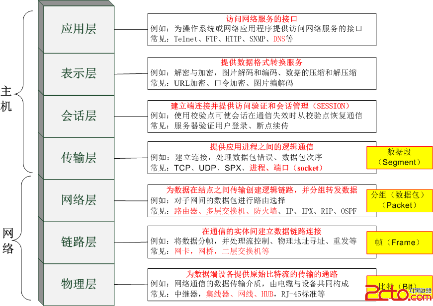
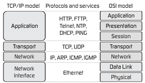
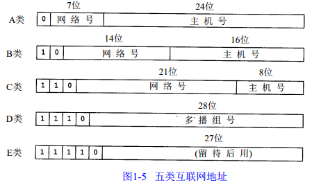
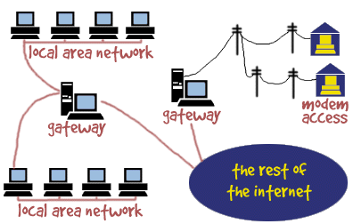

# Linux学习笔记

## 1. Linux常用命令

### 1.1 命令基本格式

* `[root@localhost ~]#`
	* `root`:当前用户名，root为管理员用户
	* `localhost`:主机名
	* `~`:家目录
	* `#`:超级用户的提示符（普通用户提示符为`$`）

* 命令格式：`命令 [选项] [参数]`

* 权限符`-rw-r--r--`
	* 文件类型：

### 1.2 目录操作

* `cd`

* `mkdir`:创建目录
	* `-p`:递归创建

* `rm`:删除文件
	* `-r`：删除目录
	* `-rf`：强制删除目录

* `cp 源文件 目标文件`:复制文件
	* `-r`:复制目录
	* `-p`:连同文件属性复制
	* `-d`:若源文件是链接文件，则复制链接属性
	* `-a`:相当于`-pdr`

* `mv 源文件 目标文件`:移动
	* 源文件和目标文件在同一目录下相当于改名

### 1.3 常见目录含义

* `/`:根目录
* `/bin`:执行指令
* `/sbin`:root的执行指令
* `/dev`:硬件文件
* `/etc`:配置文件目录
* `/lib`:函数库目录
* `/media`:挂载目录
* `/mnt`:挂载目录
* `/misc`:挂载目录
* `/sys`:写入内存的目录，不可以操作
* `/proc`:写入内存目录，不可以操作
* `/usr`:系统资源保存目录
* `/var`:系统可变文档目录
* `/temp`:临时目录

### 1.4 链接命令

* 硬链接
	* 拥有相同的i节点和block块，相当于同一个文件，但引用计数增大
	* 删除其中一个，另一个不受影响
	* 修改其中一个，另外一个也会修改
	* 可通过i节点识别
	* 只能针对文件，不能针对目录
	* 不能跨磁盘的分区

* 软链接
	* 类似windows的快捷方式
	* 软链接拥有自己的i节点和block块，但是数据库中只保存原文件的文件名和i节点号，并没有实际的数据
	* 元文件删除后，软链接也不能使用
	* 修改任意文件，另一个都会修改
	* 软链接文件类型为l，文件权限为lrwxrwxrwx，但具体权限需要根据源文件来判断
	* **软链接一定要写成绝对路径**

* `ln [源文件] [目标文件]`
	* `-s`:软链接

### 1.5 文件搜索命令

* 1.5.1 文件搜索命令`locate`
	* 使用：`locate [文件名]`
	* 在后台数据库按文件名搜索，搜索速度快
	* 后台数据库：`/var/lib/mlocate`，但不是实时更新
	* 更新数据库：`updatedb`
	* 只能按照文件名搜索

* 1.5.2 命令搜索命令`whereis`与`which`
	* `whereis [命令名]`:显示某个命令的路径及帮助文档的路径
		* `-b`:只查找可执行文件
		* `-m`:只查找帮助文件
	* `which [命令名]`:搜索命令的路径以及命令的别名
	* PATH环境变量：定义的是系统搜索命令的路径

* 1.5.3 文件搜索命令`find`
	* 使用：`find [搜索范围] [搜索文件]`
	* find为精确查询，若模糊查询，需使用通配符
	* 高级用法
		* `find /root -name install.log`：查找文件
		* `find /root -iname install.log`:不区分大小写
		* `find /root -user root`：按照所有者查找
		* `find /root -nouser`：查找没有所有者的文件（内核产生的，来自其他系统，比如U盘拷贝，垃圾文件）
		* `find /var/log/ -mtime +10`：查找10天前修改的文件
			* -10：10天内的文件
			* 10：10天当天修改的文件
			* +10：10天前的文件
			* -atime：文件访问时间
			* -ctime：改变文件属性
			* -mtime：修改文件内容
		* `find /var/log -size 25k`：查找文件大小为25k的文件
			* +25k：大于25k的文件
			* 25k：等于25k的文件
			* -25k：小于25k的文件
			* +2M：大于2M的文件
			* **注意：k为小写，M为大写，且不能不带单位**
		* `find /var/log -inum 232323`：查找i节点为232323的文件
		* `find /var/log -size +20k -a -size -50k`：查找大于20k小于50k的文件
			* `-a`：逻辑与
			* `-o`：逻辑或
		* `find /var/log -size +20k -exec ls -lh {} \;`：将查找到的文件使用`ls -lh`处理显示
			* `-exec`：连接命令指令
	* Linux通配符：
		* `*`:匹配任意内容
		* `?`:匹配任意一个字符
		* `[]`:匹配任意一个中括号内的内容

* 1.5.4 字符串搜索命令`grep`
	* `grep [选项] 字符串 文件名`：在文件中查找指定的字符串
		* `-v`：排除想hi定的字符串
		* `-i`：忽略大小写

* 1.5.5 `find`命令与`grep`命令的区别
	* **find**：在系统中搜索符合条件的文件名，如果需要匹配，使用通配符匹配，通配符为完全匹配
	* **grep**：在指定文件中搜索符合条件的字符串，如果需要匹配，使用正则表达式进行匹配，正则表达式为包含匹配

### 1.6 帮助命令

* `man [选项] 命令`
	* `-f`：类似于whatis
	* `-k`：所有含有关键字的帮助文档
	* man的等级
* 其他帮助命令
	* `命令 --help`
	* `help shell内部命令`
	* `info 命令`

### 1.7 压缩与解压缩命令

* 常用压缩格式：.zip，.gz，.bz2，.tar.gz，.tar.bz2

* `.zip`：
	* `zip 压缩文件名 源文件`：压缩文件
	* `zip -r 压缩文件名 源目录`：压缩目录
	* `unzip 源文件`：解压缩
* `.gz`：
	* `gzip 源文件`：压缩为.gz格式的压缩文件，源文件会消失
	* `gzip -c 源文件 > 压缩文件`：压缩，源文件不消失
	* `gzip -r 源目录`：压缩目录下的所有的子文件，但不能压缩目录
	* `gzip -d 源文件`：解压缩文件
	* `gunzip 源文件`：解压缩文件
* `.bz2`:
	* `bzip2 源文件`：压缩为.bz2格式，不保留源文件
	* `bzip2 -k 源文件`：压缩之后保留源文件
	* `bzip2 -d 源文件`：解压缩，-k保留压缩文件
	* `bunzip2 源文件`：解压缩，-k保留压缩文件
	* bzip2命令只能压缩文件，不能压缩目录
* `.tar.gz`
	* `tar -cvf 打包文件名 源文件`：打包
		* `-c`：打包
		* `-v`：显示过程
		* `-f`：指定打包后的文件名
	* `tar -xvf 打包文件名`：解打包
		* `-x`：解打包
	* `tar -zcvf 压缩包名.tar.gz 源文件`：压缩为.tar.gz
		* `-z`：压缩为.tar.gz格式
	* `tar -zxvf 压缩包名.tar.gz`：解压缩.tar.gz文件
	* `tar -jcvf 压缩包名.tar.bz2`：压缩为.tar.bz2文件
	* `tar -jxvf 压缩包名.tar.bz2`：解压缩.tar.bz2文件
	* `tar -ztvf 压缩包名.tar.gz`：只查看压缩文件，不解压

### 1.8 关机与重启命令
	
* shutdown命令，可以保存状态
	* `shutdown [选项] 时间`
		* `-c`：取消前一个关机
		* `-h`：关机
		* `-r`：重启
		* `now`：当前时间
* 其他关机命令
	* `halt`
	* `poweroff`
	* `init 0`
* 其他重启命令
	* `reboot`
	* `init 6`
* **退出登录**
	* `logout`：每次用完，一定要退出登录
* 系统运行级别
	* 0：关机
	* 1：单用户
	* 2：不完全多用户，不含NFS服务
	* 3：完全多用户
	* 4：未分配
	* 5：图形界面
	* 6：重启
	* `runlevel`：查看系统运行级别

### 1.9 挂载命令

* `mount`：查询系统中已经挂载的设备
* `mount -a`：依据配置文件/etc/fstab的内容，自动挂载
* `mount [-t 文件系统] [-o 特殊选项] 设备文件名 挂载点`
	* `-t`：文件系统，可以ext3,ext4, iso9660
	* `-o`：特殊选项
* `mount [-t iso9660] /sda/sr0 /mnt/cdrom`：挂载光盘
	* ios9660：光盘默认的文件系统
* `umount /mnt/cdrom`：卸载光盘
* `mount -t vfat 设备文件名 /mnt/udisk`：挂载U盘
	* 设备文件名：可通过`fdisk -l`查看

### 1.10 用户登录查看

* `w`：查看用户的信息
* `who`：查看简单用户信息
* `last`：查询当前登录和过去登陆的用户信息
	* 默认读取/var/log/wtmp文件的信息
* `lastlog`：查看所有用户的最后一次登录时间
	* 读取/var/log/lastlog文件信息

## 2. Shell基础

### 2.1 Shell概述

* Shell是什么？
	* Shell是一个命令行解释器，它为用户提供了一个向Linux内核发送请求以便运行程序的界面系统级程序，用户可以用Shell来启动、挂起、停止甚至是编写一些程序
	* Shell还是一个功能强大的编程语言，易编写、易调试、灵活性较强。Shell是解释执行的脚本语言，在Shell中可以直接调用Linux系统命令
* Shell脚本执行方法
	* `echo [选项] 输出内容`：
		* `-e`：支持控制字符
		* 常用控制字符
			* \a:输出警告音
			* \b:退格符，向左删除
			* \n:换行符
			* \r:回车键
			* \t:制表符，tab
			* \v:垂直制表符
			* \0nnn:按八进制ASCII码表输出，nnn为3位八进制数
			* \xhh:按十六进制ASCII码表输出，其中hh是两位十六进制数
		* 输出颜色
			* `\e[1;31m hello world \e[0m`
				* `\e[1;`:启动颜色
				* `\e[0m`：关闭颜色
				* 常用颜色：
					* 30m:黑
					* 31m:红
					* 32m:绿
					* 33m:黄
					* 34m:蓝
					* 35m:洋红
					* 36m:青
					* 37m:白
* 第一个脚本
	* `#!/bin/bash`：开头，必须
	* 执行方式
		* `bash hello.sh`
		* `chmod 755 hello.sh;./hello.sh`

### 2.2 别名与快捷键

* 别名
	* `alias`：查看所有别名
	* `alias vi='vim'`：设置别名，只是临时生效，重启失效
	* `unalias vi`：删除别名，临时删除
	* `vim ~/.bashrc`；`source .bashrc`：写入环境变量配置文件，则一直生效
* 命令生效顺序
	* （1）执行用绝对路径或相对路径执行的命令
	* （2）执行别名
	* （3）执行Bash的内部命令
	* （4）执行按照$PATH环境变量定义的目录查找顺序找到的第一个命令
* 快捷键
	* `ctrl + c`：强制终止当前命令
	* `ctrl + l`：清屏
	* `ctrl + a`：光标移动到命令行首
	* `ctrl + e`：光标移动到命令行尾
	* `ctrl + u`：从光标所在位置删除到行首
	* `ctrl + z`：命令放入后台
	* `ctrl + r`：在历史命令中搜索

### 2.3 历史命令

* `history`：查看系统历史命令，保存在家目录.bash_history文件
* 默认保留1000条，可以通过修改`/etc/profile`中的HISTSIZE
* `history -c`：清空历史命令
* `history -w`：刷新保存文件中的历史命令
* `!n`：重复执行第n条命令
* `!!`：重复执行上一条命令
* `!字符串`：重复执行最后一条以该字符串开头的命令

### 2.4 输出重定向

* 标准输入输出

| 设备 | 设备文件名 | 文件描述符 | 类型 |
| :--- | :--- | :---: | :--- |
| 键盘 | /dev/stdin | 0 | 标准输入 |
| 显示器 | /dev/stdout | 1 | 标准输出 |
| 显示器 | /dev/stderr | 2 | 标准错误输出 |

* 输出重定向

| 类型 | 符号 | 作用 |
| :--- | :---: | :--- |
| 标准输出重定向 | `命令 > 文件` | 覆盖的方式输出到文件中 |
| 标准输出重定向 | `命令 >> 文件` | 追加的方式输出到文件中 |
| 错误输出重定向 | `命令 2>文件` | 追加的方式将错误信息输出到文件中 |
| 错误输出重定向 | `命令 2>>文件` | 追加的方式将错误信息输出到文件中 |
| 正确和错误输出同时保存 | `命令 >> 文件 2>&1` | 追加方式，正确和错误保存到同一文件中 |
| 正确和错误输出同时保存 | `命令 &>>文件` | 追加方式，正确和错误保存到同一文件中 |
| 正确和错误输出同时保存 | `命令 >>文件1 2>>文件2` | 追加方式，正确的输出到文件1，错误的追加到文件2 |
注意：使用`2>>`，`&>>`时，后面与文件之间不能有空格

* 输入重定向
	
	* `wc [选项名] [文件名]`
		* `-c`：统计字节数
		* `-w`：统计单词数
		* `-l`：统计行数
	* `命令 < 文件`：把文件作为命令的输入
	* `命令 << 标识符`：把标识符之间的内容作为命令的输入

### 2.5 管道符

* 多命令顺序执行

| 执行符 |  格式 | 作用 |
| :---: | :--- | :--- |
| `;` | `命令1 ; 命令2` | 多个命令顺序执行，命令之间没有逻辑关系 |
| `&&` | `命令1 && 命令2` | 逻辑与，命令1正确执行的情况下，命令2才会执行 |
| `逻辑或` | 命令1 或 命令2 | 逻辑或，当命令1执行不正确，则命令2才会执行；当命令1正确执行，则命令2不会执行 |
注意：`逻辑或`为`||`符号

* 管道符
	* `命令1 | 命令2`：命令1的正确输出作为命令2的输入信息
	* 例如：`netstat -an | grep ESTABLISHED`：使用管道符，查找网络中建立连接状态的信息

### 2.6 通配符

* 通配符

| 通配符 | 作用 |
| :---: | :--- |
| `*` | 匹配任意字符，个数不确定 |
| `?` | 匹配任意一个字符 |
| `[]` | 匹配中括号中任意一个字符，例如[abc]，匹配a或b或c |
| `[-]` | 匹配中括号任意一个字符，-代表范围，例如[a-z]代表匹配一个小写字母 |
| `[^]` | 逻辑非，匹配不是中括号内的一个字符，例如[^0-9]代表匹配一个不是数字的字符 |

* bash中其他特殊符号

| 符号 | 作用 | 示例 |
| :---: | :--- | :--- |
| `''` | 单引号，但单引号中所有特殊字符都无含义，如$等 | `echo '$hello'`，打印$hello |
| `“”` | 双引号，双引号中的特殊字符有含义 | `echo "$hello"`，打印hello的值 |
| ` `` ` | 反引号，反引号中的为系统命令，会先执行 |  |
| `$()` | 与反引号作用相同，调用系统命令，推荐使用 | `echo $(ls)`，打印ls执行的结果 |
| `#` | shell脚本中的注释符 | # hello world |
| `$` | 用来调用变量的值 | `echo $name`，打印name的值 |
| `\` | 转义符，对特殊符号进行转义 | `echo \$`，打印$ |

## 3. vim编辑器

### 3.1 vim的操作模式

* 命令模式
	* `vim hello.sh`:打开文件
	* `vim + hello.sh`:打开文件，光标定位到最后一行
	* `vim +3 hello.sh`:打开文件，光标定位到第3行或最后一行
	* `vim +/xxx hello.sh`:打开文件，光标定位到xxx出现的第一次位置
	* `vim aa bb cc`:同时打开多个文件，底行模式，`:n`切换到下一个文件，`:N`切换到上一个文件
* 底行模式
* 编辑模式

### 3.1 常用指令

* 底行模式
	* `:w`:写入文件
	* `:q`:退出
	* `:!`:强制执行
	* `:ls`:列出所有文件
	* `:n`:切换到下一个文件
	* `:N`:切换到上一个文件
	* `:15`:光标切换到15行
	* `/xxx`:查找xxx字符串从光标位置向后搜索第一次出现位置
	* `?xxx`:查找xxx字符串从光标位置向前搜索第一次出现位置
* 命令模式
	* `h`:光标左移
	* `j`:光标下移
	* `k`:光标上移
	* `l`:光标右移
	* `ctrl + f`:向上翻页（front）
	* `ctrl + b`:向下翻页（back）
	* `ctrl + d`:向下翻半页（down）
	* `ctrl + u`:向上翻半页（up）
	* `dd`:删除光标所在行
	* `o`:在光标所在行下方插入一行并切换到输入模式
	* `yy`:复制光标所在的行
	* `p`:在光标所在行的下方粘贴
	* `P`:在光标所在行的上方粘贴
* 详细vim指令，参考键位图

## 4. 磁盘管理

### 4.1 磁盘管理命令

* `df`：查看磁盘分区的使用状况
	* `-l`：仅显示本地磁盘，默认
	* `-a`：显示所有文件系统的磁盘使用情况，比如/proc/
	* `-h`：以1024进制计算最合适的单位显示磁盘容量
	* `-H`：以1000进制计算最合适的单位显示磁盘容量
	* `-T`：显示磁盘分区类型
	* `-t`：显示指定类型文件系统的磁盘分区
	* `-x`：不显示指定类型文件系统的磁盘分区
* `du`：统计磁盘上文件的大小
	* `-b`：以byte为单位统计文件
	* `-k`：以kb为单位统计文件
	* `-m`：以mb为单位统计文件
	* `-h`：按照1024进制以最合适单位统计文件
	* `-H`：按照1000进制以最合适单位统计文件
	* `-s`：统计指定目标

### 4.2 硬盘分区与格式化

* 分区特点
	* 主分区和扩展分区不能超过4个
	* 扩展分区最多只能有一个
	* 扩展分区不能直接存取数据，必须建立逻辑分区
* 添加新硬盘
	* 添加的新硬盘必须分区、格式化、挂载后才可以使用
* 两种分区模式：MBR和GPT
* MBR分区
	* `fdisk`：查看磁盘使用
	* `fdisk -l`：查看所有的磁盘使用
	* `fdisk /dev/sdb`：编辑sdb磁盘，可以进行分区操作
		* `m`：查看帮助
		* `p`：列出分区
		* `n`：新建分区
		* `d`：删除分区
		* `w`；写入分区
	* `mkfs -t ext4 /dev/sdb1`：格式化分区
	* `mount /dev/sdb1 /mnt/disk`：挂载分区 
	* `umount /dev/sdb1 /mnt/disk`：卸载分区 
	* 特点：
		* 主分区不超过4个
		* 单个分区容量最大2TB
* GPT分区
	* `parted`：GPT分区工具
		* `select /dev/sdb`：指定需要操作的磁盘
		* `mklabel gpt`：指定需要操作的磁盘的分区模式为GPT
		* `print`：列出所有分区
		* `help`：帮助
		* `mkpart`：新建分区，交互模式和命令模式
		* `rm`：删除分区
		* `unit GB`：默认指定大小单位为MB，可以指定为GB
		* `quit`：退出，mkpart后立即生效
	* 特点：
		* 主分区个数几乎没有限制
		* 单个分区容量几乎没有限制
		* 无主分区、扩展分区、逻辑分区的概念
* 格式化分区
	* `mkfs.ext3 /dev/sdb1`
	* `mkfs -t ext4 /dev/sdb2`
* 挂载/卸载磁盘
	* `mount /dev/sdb1 /mnt/disk`：
	* `umount /dev/sdb1`：
* 开机自动挂载
	* 编辑`/etc/fst`：
	* 增加`/dev/sdb1	/mnt/disk	ext4	defaults	0	0`：
* 创建swap分区
	* `t`：在`fdisk /dev/sdb`修改分区的类型编号为82
	* `w`：在`fdisk /dev/sdb`写入分区信息
	* `mkswap /dev/sdb6`：格式化swap分区
	* `swapon /dev/sdb6`：挂载swap分区
	* `swapoff /dev/sdb6`：卸载swap分区

## 5. 用户和用户组

### 5.1 用户和用户组

* 用户：使用操作系统的人
* 用户组：具有使用系统权限的一组用户

### 5.2 配置文件

* `/etc/group`：存储当前系统中所有用户组信息

|Group|x|123|adb,xyz|
|:---|:---|:---|:---|
|组名称|组密码占位符|组编号|组中用户名列表|

注意：
1. root用户组组号为0
2. 组号1——499为系统组号，为系统服务
3. 用户手动创建的用户组的组号为500以后
4. 组密码占位符为x

* `/etc/gshadow`：存储系统组密码的文件，每一行与group对应

|Group|*||adb,xyz|
|:---|:---|:---|:---|
|组名称|组密码|组管理者|族中用户名列表|

* `/etc/passwd`：存在当前系统中所有用户的信息

|user|x|123|456|xxxxxx|/home/user|/bin/bash|
|:---|:---|:---|:---|:---|:---|:---|
|用户名|密码占位符|用户编号|用户组编号|用户注释信息|用户主目录|shell类型|

* `/etc/shadow`：存储当前系统中所有用户的密码信息，与passwd中对应

### 5.3 用户组和用户基本管理命令

* `groupadd g1`：新建一个g1组
* `groupmod -n g2 g1`：修改组名称g1为g2
* `groupmod -g 668 g2`：修改组g2编号为688
* `groupadd -g 888 g3`：新建编号为888的组g3
* `groupdel g2`：删除用户组g2，但首先要先删除用户组的用户
* `useradd -g g1 u1`：向用户组g1中增加用户u1，会自动在home中创建个人文件夹
* `useradd -d /home/u2 u2`：创建用户u2并创建个人文件夹/home/u2
* `usermod -c xxxxx u2`：增加用户u2的注释
* `usermod -l u3 u2`：将用户u2修改为u3
* `usermod -d /home/u3 u3`：修改u3的个人文件夹
* `usermod -g g1 u3`：将用户u3移动到组g1中
* `userdel u1`：删除用户u1
* `userdel -r u1`：删除用户u1，并删除个人文件夹
* `touch /etc/nologin`：禁止除root外的其他用户登录，空文件即可
* `passwd -l u1`：锁定u1用户，禁止登录
* `passwd -u u1`：解锁u1用户
* `passwd -d u1`：删除u1的密码，支持无密码登录

### 5.4 主要组和附属组

* `gpasswd -a u1 g2`：将用户u1添加到附属组g2
* `gpasswd -d u1 g2`：将用户u1从附属组g2中移除
* `newgrp g2`：u1用户登录后，默认为主要组g1，可以通过此命令切换到用户组g2
* `useradd -g g1 -G g2,g3 u2`：创建用户u2，指定其主要组为g1，附属组为g2,g3
* `gpasswd g1`：设置组g1的组密码

### 5.5 其他命令

* `su`：切换到root用户，任意用户都可以，但需要密码
* `su u1`：切换到u1用户，需要u1用户的密码
* `whoami`：查看当前的用户名
* `id u1`：显示用户u1的信息，用户编号、用户名、主要组编号及名称、附属组列表
* `groups u1`：显示用户u1所在的所有组
* `chfn u1`：设置用户详细资料，依次输入
* `finger u1`：显示用户详细资料

## 6. Linux网络管理

### 6.1 ISO/OSI七层模型

### 6.2 TCP/IP四层模型

#### 6.2.1 数据封装过程

#### 6.2.2 IP地址详解

* IP地址分类

* 子网掩码：表明主机地址，与IP地址相与

#### 6.2.3 DNS

* DNS：域名解析系统，进行域名和IP之间的转换
* 早期使用Hosts文件解析域名
* DNS服务的作用
	* 将域名解析为IP
		* 客户机向DNS服务器发送域名查询请求
		* DNS服务器告知客户机WEB服务器的IP地址
		* 客户机与WEB服务器通信
	* 域名空间结构：`www.imooc.com`
		* 根域：`.`
		* 顶级域：
			* 组织域：`com`，`org`，`edu`
			* 国家和地区域：`cn`，`hk`，`uk`
		* 二级域：`imooc`，`ibm`
		* 主机名：`www`
* DNS查询过程

* DNS查询类型
	* 按查询方式：
		* 递归查询：要么查询成功，要么查询失败；一般客户机和服务器之间属于递归查询
		* 迭代查询：服务器收到一次迭代查询回复一次结果，这个结果不一定是目标IP与域名的映射关系，也可以是其他DNS服务器的地址
	* 按查询内容：
		* 正向查询：由域名查找ip
		* 反向查询：由ip查找域名

#### 6.2.4 网关（Gateway）

* 网关示意图

* 网关作用
	* 如果所有内网计算机访问的不是本网段的数据报，则需要交给网关进行处理
	* 负责将内网IP转换为公网IP，公网IP转换为内网IP
* 网络设备
	* 交换机：
		* 只能识别MAC，可实现局域网通信，来分配网络数据
		* 在数据链路层，根据MAC地址寻址
		* 把很多主机连起来，对外各有各自的IP
		* 做端口扩展，扩大局域网的接入点
	* 路由器：
		* 路由器可以该局域网自动分配IP，进行数据路由；
		* 在网络层，根据IP地址寻址，可以处理TCP/IP协议；
		* 可以把一个IP分配给多个主机使用，对外表现出一个IP
		* 提供防火墙服务器
		* 做网间连接，用来连接不同的网络

### 6.3 Linux中IP地址配置

* ifconfig命令临时配置IP地址
* setup工具永久配置IP地址（redhat）
* 修改网络配置文件
	* 一切配置皆为文件
	* 网卡信息文件：`/etc/sysconfig/network-scripts/ipcfg-eth0`
	* 主机名文件：`/etc/sysconfig/network`
	* DNS配置文件：`/etc/resolv.conf`
* 图像界面配置IP

### 6.4 Linux网络命令

* `ifconfig`：查看与配置网络状态信息
* `ifdown 网卡`：禁用该网卡设备
* `ifup 网卡`：启用该网卡设备
* `netstat 选项`：查询网络状态
	* `-t`：列出TCP协议端口
	* `-u`：列出UDP协议端口
	* `-n`：不使用域名与服务名，而是用IP地址和端口号
	* `-l`：仅列出在监听状态网络服务
	* `-a`：列出所有的网络连接
* `route 选项`：
	* `-n`：列出路由表信息
* `nslookup IP`：查看DNS信息
* `ping [选项] 主机名`：探测指定ip或域名的网络状况
	* `-c 次数`：指定ping包次数
* `telnet [域名或IP] [端口]`：远程管理与端口弹出命令
* `traceroute [选项] IP或域名`：路由跟踪命令
	* `-n`：使用IP，不使用域名，速度更快
* `wget <url>`：下载命令
* `tcpdump -i eth0 -nnX port 21`：抓包命令
	* `-i`：指定网卡接口
	* `-nn`：将数据包中的域名与服务转为IP和端口
	* `-X`：以十六进制和ASCII码显示数据包内容
	* `port`：指定监听的端口

### 6.5 Linux远程登录

* 加密算法
	* 对称加密算法：采用单钥密码系统的加密方法，同一个密钥可以同时用作信息的加密和解密
	* 非对称加密算法：
* SSH安全外壳协议
	* `ssh 用户名@ip`：远程管理指定Linux服务器
	* `scp [-r] 用户名@ip:文件路径 本地路径`：下载文件
	* `scp [-r] 本地文件 用户名@ip:上传路径`：上传文件

## 6. Shell编程基础

### 6.1 Bash变量

#### 6.1.1 Bash变量概述

* 变量命名规则：
	* 以字母和下划线打头，名字中间只能有字母、数字和下划线组成
	* 长度不超过255字符
	* 变量所有类型都为字符串型
	* 有效范围内唯一
* 其他语言变量的分类
	* 字符串型
	* 整型
	* 浮点型
	* 日期型
* Bash变量分类
	* 用户自定义变量：用户可以随意定义
	* 环境变量：主要保存和系统操作环境相关的数据，变量名和变量作用是固定的
	* 位置参数变量：用来向脚本当中传递参数和和数据的，变量名不能自定义，变量作用是固定的
	* 预定义变量：bash中定义好的变量，变量名不能自定义，变量作用固定

#### 6.1.2 用户自定义变量

* 变量定义：
	* `name="jiang fan"`
	* 变量不能数字开头
	* 等号左右不能有空格
	* 变量有空格需要`""`括起来
* 变量调用：
	* `$name`：如`echo $name`
* 变量叠加
	* `name="$name"1992`：name新值为`jiang fan1992`
	* `name=${name}1992`：name新值为`jiang fan1992`
* 变量提示错误
	* `set -u`：当变量不存在时报错
* 变量删除
	* `unset name`

#### 6.1.3 环境变量

* 环境变量为全局变量，自定义变量为局部变量
* 对系统生效的环境变量名和变量作用是固定的
* 用户自定义环境变量
	* `export 变量名=变量值`
	* `export 变量名`
* 查看环境变量
	* `env`
* 建议环境变量名大写
* 常用环境变量
	* `PATH`：系统查找命令的路径
	* `PS1`：命令提示符设置
		* `\d`：显示日期
		* `\H`：显示完成主机名
		* `\t`：显示24小时制时间如HH:MM:SS
		* `\A`：显示24小时制时间如HH:MM
		* `\u`：显示当前用户名
		* `\w`：显示当前所在目录的完成名称
		* `\W`：显示当前所在目录的最后一个目录
		* `\$`：提示符，如果root会显示#，非root显示$

#### 6.1.4 语系变量

* `locale`：查看语系变量

#### 6.1.5 位置参数变量

|位置参数变量|作用|
|:---:|:---|
|`$n`|n为数字，$0表示命令本身，$1-$9表示第一到第九个参数，第十个以上需要${10}|
|`$*`|代表命令行中所有参数，$*把所有的变量当成一个总体|
|`$@`|代表命令行中所有参数，把所有变量分别对待|
|`$#`|代表命令行中所有参数的个数|

#### 6.1.6 预定义变量

|预定义变量|作用|
|:---:|:---|
|`$?`|最后一条执行的命令的返回状态，如果为0，证明执行正确；如果非0，执行错误|
|`$$`|当前进程的进程好PID|
|`$!`|后台运行的最后一个进程的进程号PID|、

#### 6.1.7 接收键盘输入

`read [选项] [变量]`
	* `-p "提示信息"`:等待read输入是，输出提示信息
	* `-t 秒数`：read命令会一直等待用户输入，指定等待时间
	* `-n 字符数`：只接受指定的字符数
	* `-s`：隐藏输入的数据
