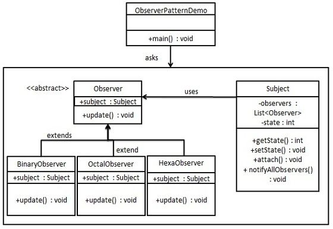

### 观察者模式

---

#### 定义

* 当对象间存在一对多关系时，则使用观察者模式（Observer Pattern）。
* 比如，当一个对象被修改时，则会自动通知它的依赖对象。
* 观察者模式属于行为型模式。
* 意图：定义对象间的一种一对多的依赖关系，当一个对象的状态发生改变时，所有依赖于它的对象都得到通知并被自动更新。

#### UML图

参考[菜鸟教程]()的观察者模式的UML图如下：

#### 自定义观察者模式

* 以网上购物为例，当一件商品的价格变动时，所有的网上商店（比如天猫，京东，亚马逊等）都需要更新该商品的价格。 

* 这其中，商品就代表观察者模式中的主题（Subject），网上商店就代表所有的观察者。 

* 主题`Subject`
	* 价格属性：`int price`
	* 所有的观察者: `List<Observer> observers`
	* 添加观察者方法`attach(Observer observer)`
	* 通知所有观察者方法：`notifyAllObserver()`
	
* 抽象观察者：`Observer`
	* 观察的主题`Subject subject`
	* 含参构造函数，可以添加自己到主题的观察者列表
	* 状态更新方法：`update()`
	
* 具体观察者：
	* 天猫：`TianmaoObserver`
	* 京东：`JingdongObserver`
	* 亚马逊：`AmazonObserver`

* 参考代码：`src/designpattern/observer`

#### 使用Java提供的观察者模型

* 还是以上述的购物为例

* 商品主题`Subject`
	* 继承`java.util.Obserbable`类
	* 属性`price`
	* `getter&setter`方法
	* `setter`方法中，调用`this.setChanged()`和`this.notifyObservers(price)`
	
* 具体观察者：
	* 实现`java.util.Observer`接口
	* 天猫：`TianmaoObserver`
	* 京东：`JingdongObserver`
	* 亚马逊：`AmazonObserver`
	* 在`update`的方法中更新价格
	
* 参考代码：`src/designpattern/observer_java`

#### 优缺点

* 优点
	* 观察者和被观察者是抽象耦合的。 
	* 建立一套触发机制。
	
* 缺点
	* 如果一个被观察者对象有很多的直接和间接的观察者的话，将所有的观察者都通知到会花费很多时间。 
	* 如果在观察者和观察目标之间有循环依赖的话，观察目标会触发它们之间进行循环调用，可能导致系统崩溃。 
	* 观察者模式没有相应的机制让观察者知道所观察的目标对象是怎么发生变化的，而仅仅只是知道观察目标发生了变化。
	
#### 使用场景

* 有多个子类共有的方法，且逻辑相同。
* 重要的、复杂的方法，可以考虑作为模板方法。

#### 注意事项

* JAVA 中已经有了对观察者模式的支持类。
* 避免循环引用。
* 如果顺序执行，某一观察者错误会导致系统卡壳，一般采用异步方式。

##### 参考

* http://www.runoob.com/design-pattern/observer-pattern.html
* http://www.2cto.com/kf/201310/253013.html
* http://blog.csdn.net/dada360778512/article/details/6977758

---
@FrankJiang

2016-9-6