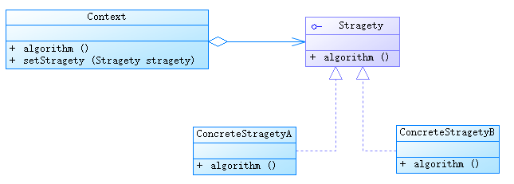

### 策略模式

---

#### 概念

* 策略模式定义了一系列的算法，并将每一个算法封装起来，而且使它们还可以相互替换。策略模式让算法独立于使用它的客户而独立变化。

* 注：针对同一类型操作，将复杂多样的处理方式分别开来，有选择的实现各自特有的操作。

* 策略模式的使用场景：

	- 针对同一类型问题的多种处理方式，仅仅是具体行为有差别时
	- 需要安全地封装多种同一类型的操作时
	- 出现同一抽象类有多个子类，而又需要使用 if-else 或者 switch-case 来选择具体子类时

#### UML图

#### 组成

* `Concext`:用来操作策略类的上下文环境
* `Strategy`: 抽象策略接口
* `ConcreteStrategy`: 具体策略实现类

#### 实例

以对数组排序为例：
* `ArraySort`: 用来操作策略类的上下文环境
	- `sort()`: 排序方法
	- `setStrategy()`: 设置策略类

* `Strategy`: 抽象策略接口
	- `sort()`: 抽象排序方法

* `BubbleSortStrategy`: 冒泡排序策略
	- `sort()`

* `SelectionSortStrategy`: 选择排序策略
	- `sort()` 

* 代码参考：`JavaNotes/src/designpattern/strategy`

##### 参考
* http://blog.csdn.net/self_study/article/details/52248437

---
@ FrankJiang

2016-8-29
