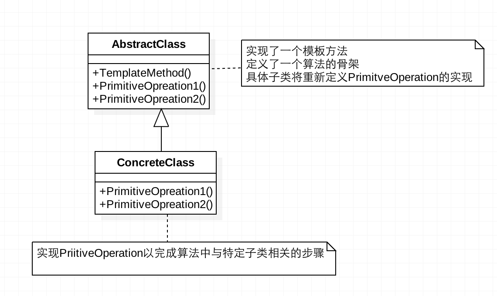

### 模板方法模式

---

#### 概念

* 定义一个操作中的算法框架，而将一些步骤延迟到子类中，使得子类可以不改变一个算法的结构即可重定义算法的某些特定步骤。 

* 模板方法模式需要开发抽象类和具体子类的设计师之间的协作。
一个设计师负责给出一个算法的轮廓和骨架，另一些设计师则负责给出这个算法的各个逻辑步骤。 
代表这些具体逻辑步骤的方法称作基本方法（primitive method）；而将这些基本方法汇总起来的方法叫做模板方法（template method）。  

* 模板方法所代表的行为称为顶级行为，其逻辑称为顶级逻辑。

* UML图

#### 特点

* 分为抽象模板和具体模板

* 抽象模板(Abstract Template)角色：

	- 定义了一个或多个**抽象方法**
		- 可以让子类实现
		- 这些抽象操作叫做基本操作，它们是一个顶级逻辑的组成步骤。
		
	- 定义并实现了一个**模板方法**
		- 模板方法一般是一个具体方法，它给出了一个顶级逻辑的骨架，而逻辑的组成步骤在相应的抽象操作中，推迟到子类实现。顶级逻辑也有可能调用一些具体方法。
		- 模版方法大多会定义为final类型，指明主要的逻辑功能在子类中不能被重写。
		
	- 可以定义一个**钩子方法**。
		- 由抽象类声明并加以实现。
		- 子类可以去扩展，子类可以通过扩展钩子方法来影响模版方法的逻辑。
		- 通常抽象类给出的实现是一个空实现，作为方法的默认实现。
		
* 具体模板(Concrete Template)角色：

	- 实现父类所定义的一个或多个抽象方法
	- 每一个抽象模板角色都可以有任意多个具体模板角色与之对应
	- 而每一个具体模板角色都可以给出这些抽象方法的不同实现，从而使得顶级逻辑的实现各不相同。

#### 案例

* 把大象装冰箱分几步

	- `打开冰箱门----放入大象----关闭冰箱门`

* 抽象模板设计(`AbstractTemplate`)

	- 定义抽象方法：
		- `open()`
		- `put()`
		- `close()`
	- 定义模板方法（final）：
		- `putInElephant()`
* 具体模板设计(`ConcreteTemplateA` 和 `ConcreteTemplateB`)

	- 继承抽象模板
	- 实现其中抽象方法
	- 若有钩子方法，可以重写钩子方法

* 具体代码: `/src/designpattern/template`

##### 参考

* http://blog.csdn.net/YJian2008/article/details/17168913
* http://blog.csdn.net/itachi85/article/details/52239914
* http://blog.csdn.net/uk8692/article/details/46764691

---
@Frank Jiang 

2016-8-29