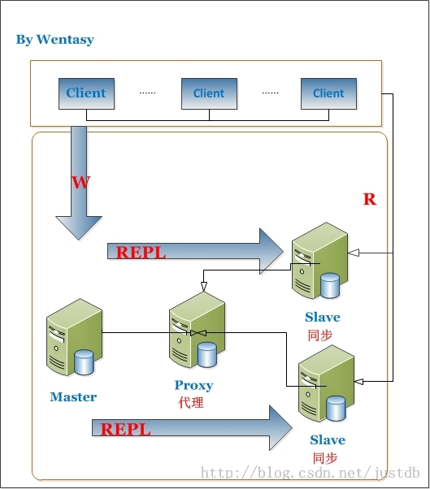

### MySQL相关

#### 事务

* 参考：
	* http://www.jb51.net/article/70617.htm

#### MySQL性能优化

* 对大数据表进行拆分，垂直拆分（将常用字段和不常用字段拆分）和水平拆分
* 使用比较小的列，列越小，操作越快
* 拆分大的delete和insert操作，因为这些操作会锁住整张表，大的表操作会使整个数据表操作阻塞
* 使用正确的存储引擎
	* MyISAM：在表查询性能非常快，但是不支持事务，而且读写操作会锁住整张表
	* InnoDB：支持行锁，读写操作的时候比较好，支持事务
* 选择合适的数据类型保存数据
* 不要用select * 
* 对常用来进行搜索的字段建立索引
	* 索引：普通索引、唯一性索引、主键索引
* 在join时用到的字段建立索引，可以提高查询性能
* 参考：
	* http://blog.csdn.net/waferleo/article/details/7179009
	* https://www.zhihu.com/question/19719997

#### 大数据的表进行优化方法
* sql本身优化：参考上面
* 增加缓存，对常查询且不常变化的数据 
* [主从复制](http://www.cnblogs.com/future2012lg/p/4873805.html)

	* 同步复制：master的变化，必须等待slave-1,slave-2,...,slave-n完成后才能返回
	* 异步复制：如同AJAX请求一样。master只需要完成自己的数据库操作即可。至于slaves是否收到二进制日志，是否完成操作，不用关心。MYSQL的默认设置
	* 半同步复制：master只保证slaves中的一个操作成功，就返回，其他slave不管
	* 主从复制示意图

	

* 读写分离
	* 主服务器处理写操作请求，并将写入的数据更新到从服务器
	* 从服务器处理读操作请求
	* 读写分离示意图

	

* TODO: 拆分，分布式存储
* 参考：http://www.jb51.net/article/23345.htm
